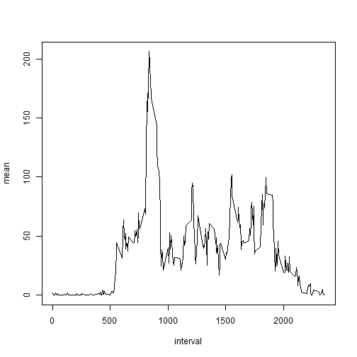

## Loading and preprocessing the data

1. Load the data (i.e. read.csv())  
2. Process/transform the data (if necessary) into a format suitable for your analysis  


First we will need to read and procees the data, in order that all data would be the class it should be.


```r
dt<-read.csv("activity.csv")
dt$date<-as.Date(dt$date) ## Save as date.
```
Each data is from the class it should be:

```r
class(dt$steps)
```

```
## [1] "integer"
```

```r
class(dt$date)
```

```
## [1] "Date"
```

```r
class(dt$interval)
```

```
## [1] "integer"
```


## What is mean total number of steps taken per day?

1. Calculate the total number of steps taken per day
2. If you do not understand the difference between a histogram and a barplot, research the difference between them. Make a histogram of the total number of steps taken each day
3. Calculate and report the mean and median of the total number of steps taken per day


We will do an histogram of the frequences of the total sums.


```r
uniq<-unique(dt$date) ## Vector with all the dates 
sum<-vector("numeric",length(uniq))
for(i in 1:61){
  sum[i]<-sum(dt[dt$date==uniq[i],]$steps)
}  ## Sum are total steps of each day

hist(sum,17)
```


Now we will calculate the mean and median of the total number of steps maken each day

```r
median(sum)
```

```
## [1] NA
```

```r
mean(sum)
```

```
## [1] NA
```


### Mean and median number of steps taken each day


```r
sp<-split(dt,dt$date)

mn<-vector("numeric",61)
md<-vector("numeric",61)

for(i in 1:61){
  mn[i]<-mean(sp[[i]]$steps)
  md[i]<-median(sp[[i]]$steps)
}


mdn<-data.frame(date=uniq,median=md,mean=mn) ## mdn is a data.frame that contain the mena and median.

mdn
```

```
##          date median       mean
## 1  2012-10-01     NA         NA
## 2  2012-10-02      0  0.4375000
## 3  2012-10-03      0 39.4166667
## 4  2012-10-04      0 42.0694444
## 5  2012-10-05      0 46.1597222
## 6  2012-10-06      0 53.5416667
## 7  2012-10-07      0 38.2465278
## 8  2012-10-08     NA         NA
## 9  2012-10-09      0 44.4826389
## 10 2012-10-10      0 34.3750000
## 11 2012-10-11      0 35.7777778
## 12 2012-10-12      0 60.3541667
## 13 2012-10-13      0 43.1458333
## 14 2012-10-14      0 52.4236111
## 15 2012-10-15      0 35.2048611
## 16 2012-10-16      0 52.3750000
## 17 2012-10-17      0 46.7083333
## 18 2012-10-18      0 34.9166667
## 19 2012-10-19      0 41.0729167
## 20 2012-10-20      0 36.0937500
## 21 2012-10-21      0 30.6284722
## 22 2012-10-22      0 46.7361111
## 23 2012-10-23      0 30.9652778
## 24 2012-10-24      0 29.0104167
## 25 2012-10-25      0  8.6527778
## 26 2012-10-26      0 23.5347222
## 27 2012-10-27      0 35.1354167
## 28 2012-10-28      0 39.7847222
## 29 2012-10-29      0 17.4236111
## 30 2012-10-30      0 34.0937500
## 31 2012-10-31      0 53.5208333
## 32 2012-11-01     NA         NA
## 33 2012-11-02      0 36.8055556
## 34 2012-11-03      0 36.7048611
## 35 2012-11-04     NA         NA
## 36 2012-11-05      0 36.2465278
## 37 2012-11-06      0 28.9375000
## 38 2012-11-07      0 44.7326389
## 39 2012-11-08      0 11.1770833
## 40 2012-11-09     NA         NA
## 41 2012-11-10     NA         NA
## 42 2012-11-11      0 43.7777778
## 43 2012-11-12      0 37.3784722
## 44 2012-11-13      0 25.4722222
## 45 2012-11-14     NA         NA
## 46 2012-11-15      0  0.1423611
## 47 2012-11-16      0 18.8923611
## 48 2012-11-17      0 49.7881944
## 49 2012-11-18      0 52.4652778
## 50 2012-11-19      0 30.6979167
## 51 2012-11-20      0 15.5277778
## 52 2012-11-21      0 44.3993056
## 53 2012-11-22      0 70.9270833
## 54 2012-11-23      0 73.5902778
## 55 2012-11-24      0 50.2708333
## 56 2012-11-25      0 41.0902778
## 57 2012-11-26      0 38.7569444
## 58 2012-11-27      0 47.3819444
## 59 2012-11-28      0 35.3576389
## 60 2012-11-29      0 24.4687500
## 61 2012-11-30     NA         NA
```


## What is the average daily activity pattern?

1. Make a time series plot (i.e. type = "l") of the 5-minute interval (x-axis) and the average number of steps taken, averaged across all days (y-axis)
2. Which 5-minute interval, on average across all the days in the dataset, contains the maximum number of steps?


```r
aa<-split(dt,dt$interval)

av<-vector("numeric",length(aa))

for(i in 1:length(aa)){
  av[i]<-mean(aa[[i]]$steps,na.rm=TRUE)
}

df<-data.frame(interval=unique(dt$interval),mean=av)

plot(df,type="l")
```



```r
mx<-df[df$mean==max(df$mean),]$interval
```

So, the maxium number of steps is done in the 835th interval


## Imputing missing values

1. Calculate and report the total number of missing values in the dataset (i.e. the total number of rows with NAs)
2. Devise a strategy for filling in all of the missing values in the dataset. The strategy does not need to be sophisticated. For example, you could use the mean/median for that day, or the mean for that 5-minute interval, etc.
3. Create a new dataset that is equal to the original dataset but with the missing data filled in.
4. Make a histogram of the total number of steps taken each day and Calculate and report the mean and median total number of steps taken per day. Do these values differ from the estimates from the first part of the assignment? What is the impact of imputing missing data on the estimates of the total daily number of steps?


First we will calculate the total number of missing values in the dataset.


```r
na<-nrow(dt[complete.cases(dt),])
```

So, we can see that the total number of non-complete rows is 15264


We will fill the missing values using the mean for that 5-minute interval


```r
dt2<-dt

for(i in 1:nrow(dt)){
  if(is.na(dt[i,1])){
    dt2[i,1]<-df[df$interval==dt[i,3],]$mean
  } 
}

head(dt)
```

```
##   steps       date interval
## 1    NA 2012-10-01        0
## 2    NA 2012-10-01        5
## 3    NA 2012-10-01       10
## 4    NA 2012-10-01       15
## 5    NA 2012-10-01       20
## 6    NA 2012-10-01       25
```

```r
head(dt2)
```

```
##       steps       date interval
## 1 1.7169811 2012-10-01        0
## 2 0.3396226 2012-10-01        5
## 3 0.1320755 2012-10-01       10
## 4 0.1509434 2012-10-01       15
## 5 0.0754717 2012-10-01       20
## 6 2.0943396 2012-10-01       25
```

As we can see, all missing values are filled in dt2.                           


```r
sum2<-vector("numeric",length(uniq))
for(i in 1:61){
  sum2[i]<-sum(dt2[dt2$date==uniq[i],]$steps)
}  ## Sum is the total steps of each day.
hist(sum2,17)
```


As we can see, there is no change in the shape, but it is in the total sums.


```r
sp2<-split(dt2,dt2$date)

mn2<-vector("numeric",61)
md2<-vector("numeric",61)

for(i in 1:61){
  mn2[i]<-mean(sp2[[i]]$steps)
  md2[i]<-median(sp2[[i]]$steps)
}


mdn2<-data.frame(date=uniq,median=md2,mean=mn2) ## mdn és una data.frame que conté median i mean.

mdn2
```

```
##          date   median       mean
## 1  2012-10-01 34.11321 37.3825996
## 2  2012-10-02  0.00000  0.4375000
## 3  2012-10-03  0.00000 39.4166667
## 4  2012-10-04  0.00000 42.0694444
## 5  2012-10-05  0.00000 46.1597222
## 6  2012-10-06  0.00000 53.5416667
## 7  2012-10-07  0.00000 38.2465278
## 8  2012-10-08 34.11321 37.3825996
## 9  2012-10-09  0.00000 44.4826389
## 10 2012-10-10  0.00000 34.3750000
## 11 2012-10-11  0.00000 35.7777778
## 12 2012-10-12  0.00000 60.3541667
## 13 2012-10-13  0.00000 43.1458333
## 14 2012-10-14  0.00000 52.4236111
## 15 2012-10-15  0.00000 35.2048611
## 16 2012-10-16  0.00000 52.3750000
## 17 2012-10-17  0.00000 46.7083333
## 18 2012-10-18  0.00000 34.9166667
## 19 2012-10-19  0.00000 41.0729167
## 20 2012-10-20  0.00000 36.0937500
## 21 2012-10-21  0.00000 30.6284722
## 22 2012-10-22  0.00000 46.7361111
## 23 2012-10-23  0.00000 30.9652778
## 24 2012-10-24  0.00000 29.0104167
## 25 2012-10-25  0.00000  8.6527778
## 26 2012-10-26  0.00000 23.5347222
## 27 2012-10-27  0.00000 35.1354167
## 28 2012-10-28  0.00000 39.7847222
## 29 2012-10-29  0.00000 17.4236111
## 30 2012-10-30  0.00000 34.0937500
## 31 2012-10-31  0.00000 53.5208333
## 32 2012-11-01 34.11321 37.3825996
## 33 2012-11-02  0.00000 36.8055556
## 34 2012-11-03  0.00000 36.7048611
## 35 2012-11-04 34.11321 37.3825996
## 36 2012-11-05  0.00000 36.2465278
## 37 2012-11-06  0.00000 28.9375000
## 38 2012-11-07  0.00000 44.7326389
## 39 2012-11-08  0.00000 11.1770833
## 40 2012-11-09 34.11321 37.3825996
## 41 2012-11-10 34.11321 37.3825996
## 42 2012-11-11  0.00000 43.7777778
## 43 2012-11-12  0.00000 37.3784722
## 44 2012-11-13  0.00000 25.4722222
## 45 2012-11-14 34.11321 37.3825996
## 46 2012-11-15  0.00000  0.1423611
## 47 2012-11-16  0.00000 18.8923611
## 48 2012-11-17  0.00000 49.7881944
## 49 2012-11-18  0.00000 52.4652778
## 50 2012-11-19  0.00000 30.6979167
## 51 2012-11-20  0.00000 15.5277778
## 52 2012-11-21  0.00000 44.3993056
## 53 2012-11-22  0.00000 70.9270833
## 54 2012-11-23  0.00000 73.5902778
## 55 2012-11-24  0.00000 50.2708333
## 56 2012-11-25  0.00000 41.0902778
## 57 2012-11-26  0.00000 38.7569444
## 58 2012-11-27  0.00000 47.3819444
## 59 2012-11-28  0.00000 35.3576389
## 60 2012-11-29  0.00000 24.4687500
## 61 2012-11-30 34.11321 37.3825996
```
we can see that the only values that differ of the mdn are that with NA value.


## Are there differences in activity patterns between weekdays and weekends?

1. Create a new factor variable in the dataset with two levels - "weekday" and "weekend" indicating whether a given date is a weekday or weekend day.
2. Make a panel plot containing a time series plot (i.e. type = "l") of the 5-minute interval (x-axis) and the average number of steps taken, averaged across all weekday days or weekend days (y-axis). See the README file in the GitHub repository to see an example of what this plot should look like using simulated data.


First, we will write witch weeday it is, and then, if it is weekday or weekend.


```r
dt<-data.frame(dt,week=weekdays(dt$date),stringsAsFactors = FALSE)

dt$week<-as.character(dt$week)

for(i in 1:nrow(dt)){
  if((dt$week[i]=="dissabte")|(dt$week[i]=="diumenge")){
    dt$week[i]<-"weekend"
  }else{
    dt$week[i]<-"weekday"
  }
}
```

Now we only need to do the graph. The function aggregate that will be used splits the data and computes summary statistics.


```r
library(lattice)

tsteps<-aggregate(steps ~ interval + week, data = dt, mean)

names(tsteps) <- c("interval", "week", "Tsteps")

xyplot(Tsteps ~ interval | week, tsteps, type = "l", layout = c(1, 2))
```


